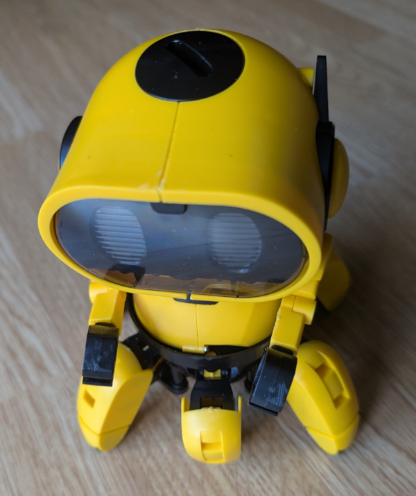
# pico-tobbie
Control Tobbie robot with a bluetooth gamepad thanks to Raspberry Pico 2 W

Code should propably work with Pico W

# Hardware
## Prepare Tobbie
Here is how to update the hardware to control Tobbie with a Raspberry Pico 2
- Remove the head
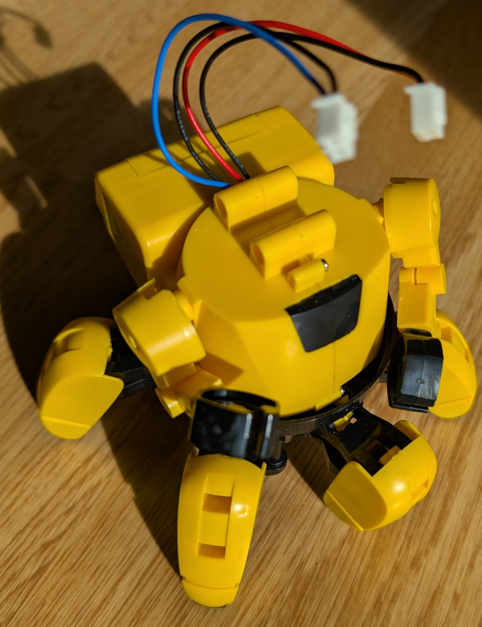
- Cut battery and motor cables and a cordon JST ZH 1,5 mm
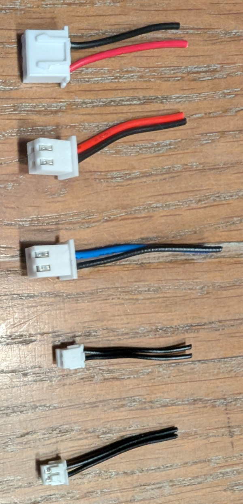
- replace motor connectors by JST ZH 1,5 mm cables

- reuse the red motor connector on the battery
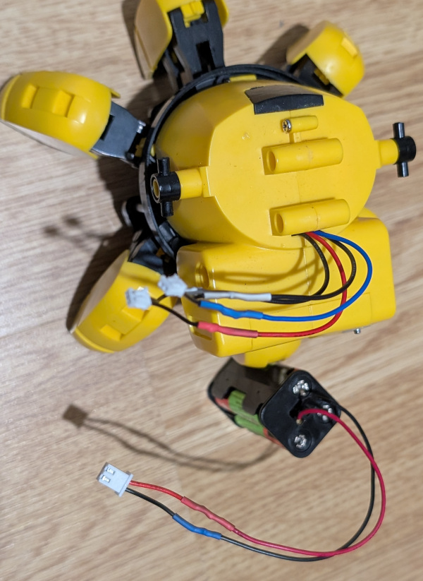
- add a power on button on the top of the head
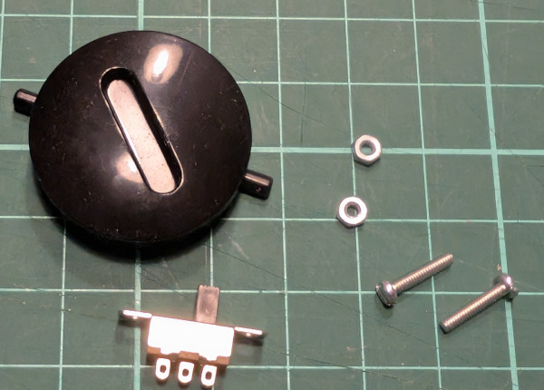
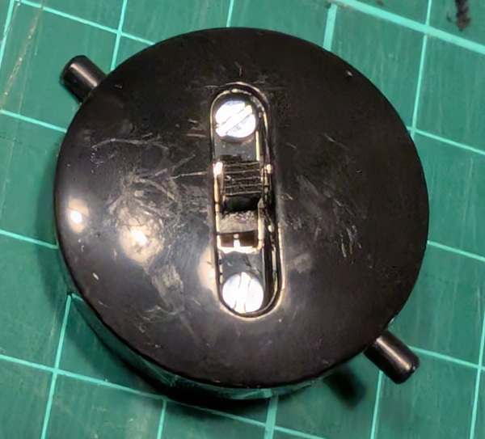
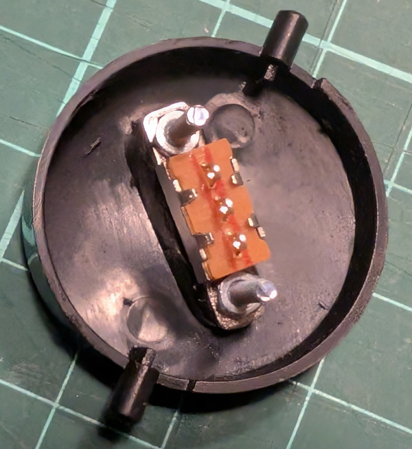

## Raspberry Pico 2W + Motor SHIM
Here is the module that will be used to control the motors:
https://shop.pimoroni.com/products/motor-shim-for-pico
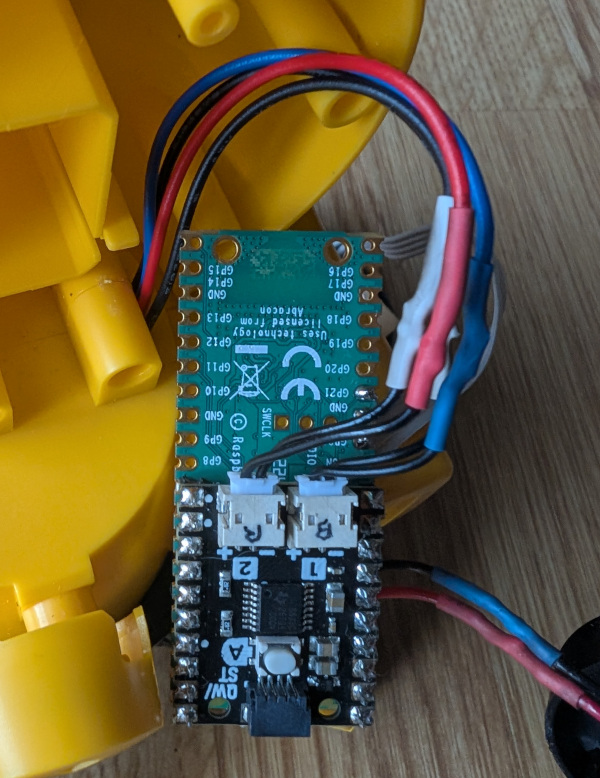
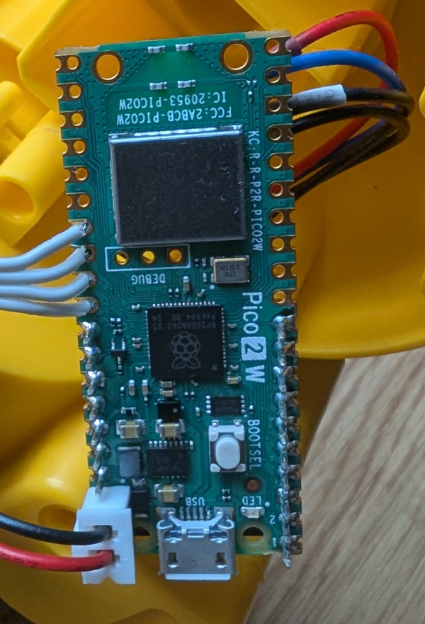
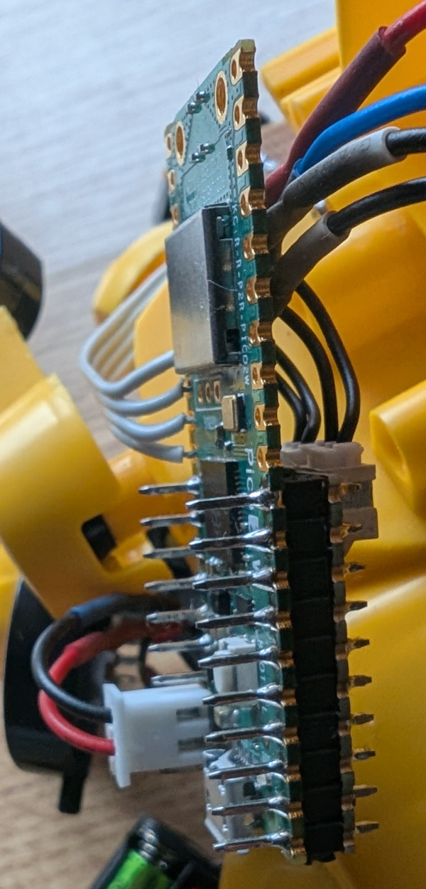


## PCB remplacement
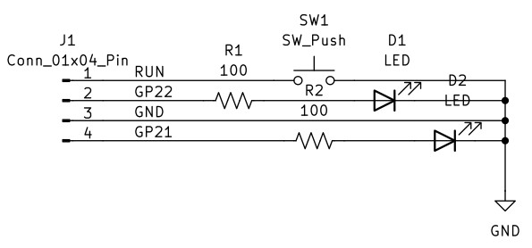
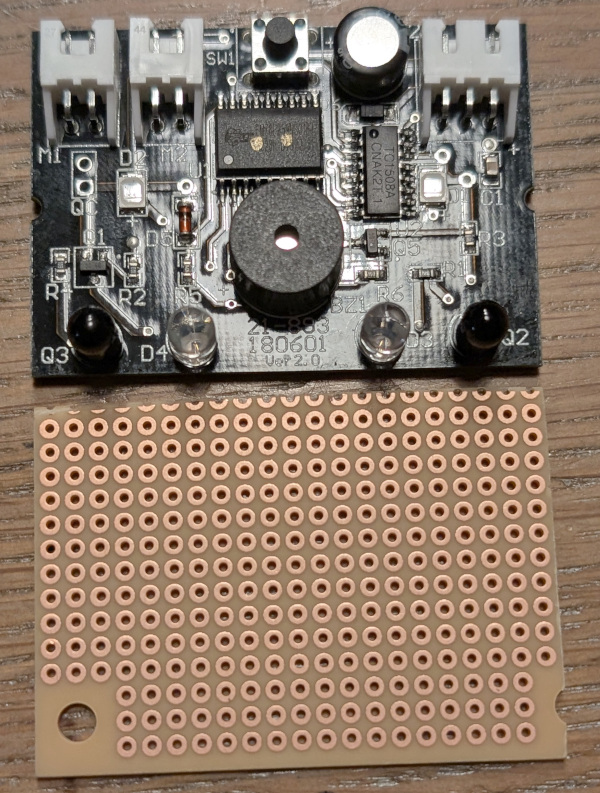
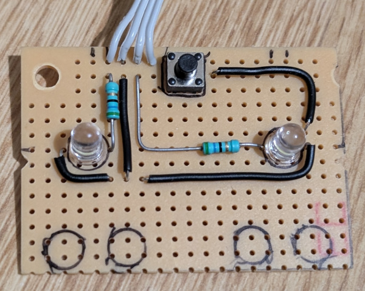
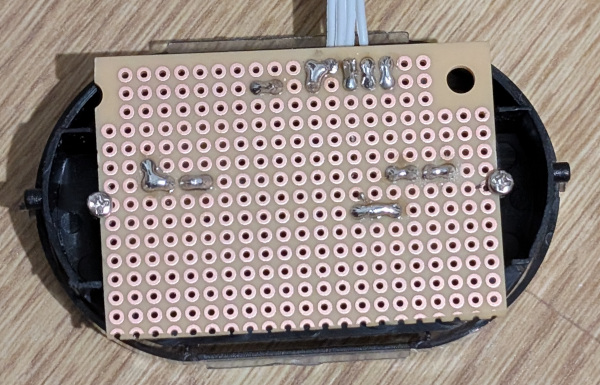
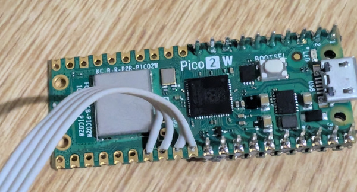
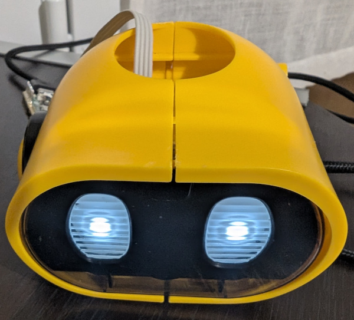

## Connect everything
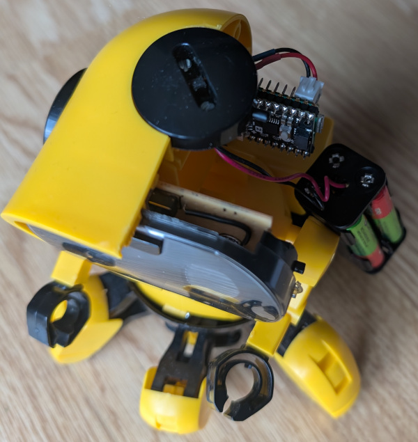
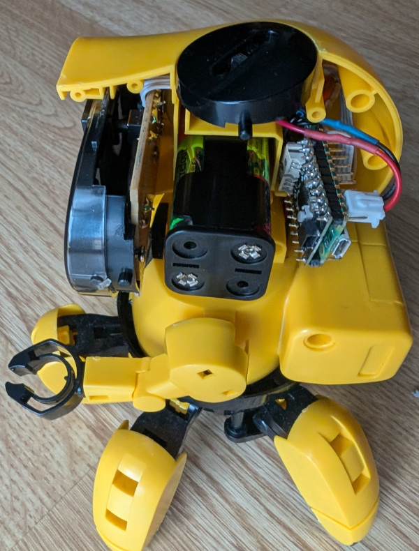

# Software

## Install dependencies

```
mkdir projects
cd projects
git clone https://github.com/raspberrypi/pico-sdk
cd pico-sdk
git submodule init
git submodule update
cd ..
git clone https://github.com/pimoroni/pimoroni-pico
git clone https://github.com/ricardoquesada/bluepad32
```

## Set up environment variables
```
export PICO_SDK_PATH=`pwd`/pico-sdk
export PIMORONI_PICO_FETCH_FROM_GIT=`pwd`/pimoroni-pico
export BLUEPAD32_ROOT=`pwd`/bluepad32
```
## Build the program

```
git clone https://github.com/colas-sebastien/pico-tobbie.git
cd pico-tobbie
mkdir build
cd build
cmake ..
make -j
```

Next step is to copy `pico-tobbie.uf2` on you pico by pressing the button and connecting it via USB
# References

- [Tobbie (by Velleman)](https://www.velleman.eu/products/view/?id=449416)
- [Motor SHIM for Pico (by Pimori)](https://shop.pimoroni.com/products/motor-shim-for-pico)
- [Control Motor SHIM code (by Pimori)](https://github.com/pimoroni/pimoroni-pico/tree/main/micropython/examples/pico_motor_shim)
- [Boiler Plate for pico (by Pimori)](https://github.com/pimoroni/pico-boilerplate)
- [BluePad32 for Pico (by Ricardo Quesada)](https://github.com/ricardoquesada/bluepad32/tree/main/examples/pico_w)

